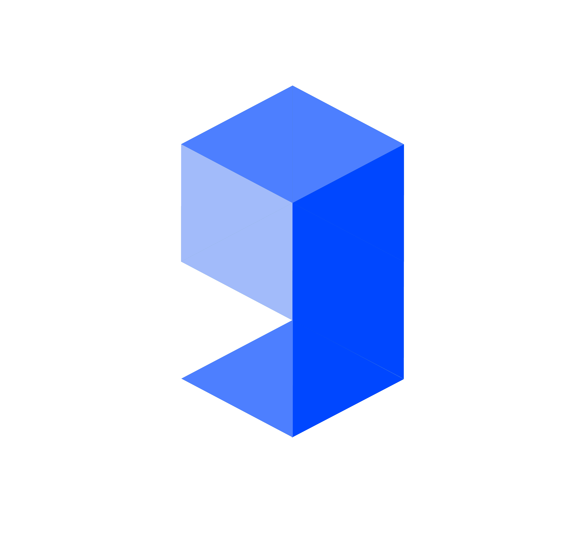

<h1 align="center">Hi , I'm KK </h1>

<h2 align="left"> About Me</h2>

› Pi-shaped Software Engineer was coding from 2005.  
› Specialized in Data Engineering, Analytics, and Machine Learning in Production. I am Data Guy by profession.  
› Worked for <100 people StartUps to 10000+ people Enterprises.  
› Data Engineering & Machine Learning/AI experience is a perfect combo. I love to build Data Products / Infra.  
› Highly inclined towards product & strategic thinking that can help to bring the vision to Goals.  
› [ENFJ](https://www.16personalities.com/enfj-personality) (“The Protagonist”) is my personality trait as per the 16 Personalities test.  
› Passionate about technology.  
› I do experimental open source projects.  
› Open to collaborate for open source projects, data consulting for non-profit orgs.  
› Fun fact: I am big fan of Egg Puffs 🥟. It was the only breakfast for many years 😄 but not anymore as habit.

[My Website](https://kannandreams.github.io/) | [LinkedIn](https://www.linkedin.com/in/kannandreams/)

<h2>
Substack Newsletter</h2>

[When Engineers meet AI](https://engineersmeetai.substack.com/) 

Read about how to create scalable, intelligent systems; spanning Data, AI Tooling, Software Engineering, and Engineering Philosophy.

<h2 align="left"> 
 Open Source Projects</h2>
<table>
<tr>
<td width="50%" valign="top">

  

<h3 align="center">
  <a href="https://github.com/kannandreams/agent-top">agent-top</a>
</h3>

<strong>htop for local coding agents</strong>

Monitor Claude Code, Codex, Gemini CLI and other local coding agents from your terminal.

  <a href="https://github.com/kannandreams/agent-top">View Project →</a>

</td>

<td width="50%" valign="top">

  

<h3 align="center">
  <a href="https://github.com/kannandreams/tuff">Tuff</a>
</h3>

<strong>Capability Lifecycle Manager for Agents</strong>

Define, manage and distribute skills, tools, hooks and reusable agent capabilities.

  <a href="https://github.com/kannandreams/tuff">View Project →</a>

</td>
</tr>

<tr>
<td width="50%" valign="top">

  

<h3 align="center">
  <a href="https://github.com/kannandreams/secchi">Secchi</a>
</h3>

<strong>Open Source Package & CLI Analytics</strong>

Local-first analytics and observability for open-source packages and command-line tools.

  <a href="https://github.com/kannandreams/secchi">View Project →</a>

</td>

<td width="50%" valign="top">

  

<h3 align="center">
  <a href="https://glyf.pages.dev/">glyf</a>
</h3>

<strong>Visualisation build tool for data pipelines</strong>

Build visualisations closer to your SQL, transformations and data pipeline.

  <a href="https://glyf.pages.dev/">View Project →</a>

</td>
</tr>
</table>

- [agent-top - htop for local coding agents](https://github.com/kannandreams/agent-top)
- [tuff - Capability Lifecycle Manager for Agents](https://github.com/kannandreams/tuff)
- [Secchi - Open Source Package & CLI Analytics](https://github.com/kannandreams/secchi)
- [glyf - Open Source Visualisation build tool to data pipeline](https://glyf.pages.dev)

