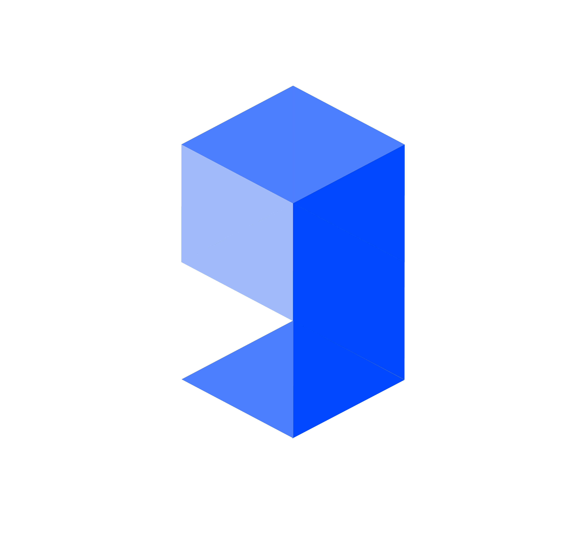
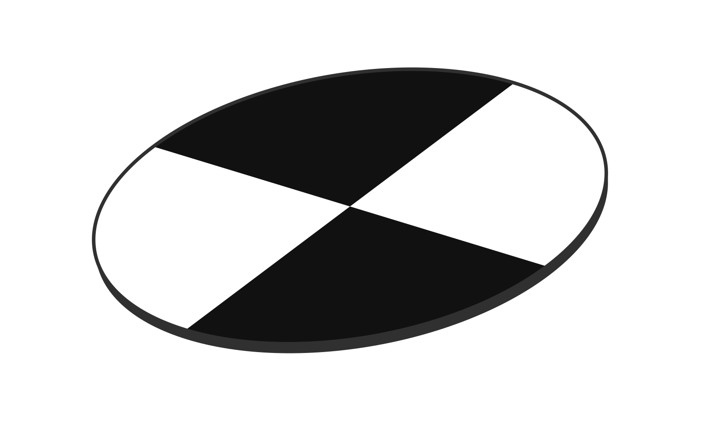

# Hey, I'm KK 👋

```text id="68vd4s"
software engineer · data + ml/ai · builder by curiosity
```

## `~/about`

```yaml id="6th4py"
coding_since: 2002
working_on: data + ai infrastructure

domains:
  - data systems
  - ml/ai
  - distributed systems
  - developer tooling
  - ai agents

exploring_next: "truncate -s 1T life.img"

experience:
  - startups <100 people
  - enterprises 10,000+ people

languages: [Python, Rust, தமிழ்]

mode: think → build → iterate
fuel: decaf mocha extra hot ☕
fun_fact: "egg puffs 🥟 were my breakfast for years — not anymore"
recent_learning: "building is easy. marketing is hard."
believes_in:
  tamil: "தெய்வத்தான் ஆகா தெனினும் முயற்சிதன் மெய்வருத்தக் கூலி தரும்"
  meaning: "Even when fate says no, effort still pays its due."
```


[Website](https://kannandreams.github.io/) · [LinkedIn](https://www.linkedin.com/in/kannandreams/) · [Newsletter](https://engineersmeetai.substack.com/)

<sub>Building things to understand how things work.</sub>

---

## Things I'm building

<table>
<tr>

<td width="25%" valign="top">


### [agent-top](https://agenttop.dev)
**htop for coding agents**

Observe local coding agents from your terminal.
</td>

<td width="25%" valign="top">


### [Tuff](https://tuffcli.dev)
**Capabilities for agents**

Manage and govern agent skills, tools, hooks and policies.
</td>

<td width="25%" valign="top">


### [Glyf](https://glyfdata.com)
**Visualisation as a build step**

Build charts and dashboards alongside your data pipelines.
</td>

<td width="25%" valign="top">


### [Secchi](https://secchi.dev)
**OSS analytics**

Local-first analytics for packages and CLI tools.
</td>

</tr>
</table>

---

## Writing

### [When Engineers Meet AI](https://engineersmeetai.substack.com/)

Notes on **AI agents, data infrastructure, developer tooling, distributed systems, and software engineering**.

---
